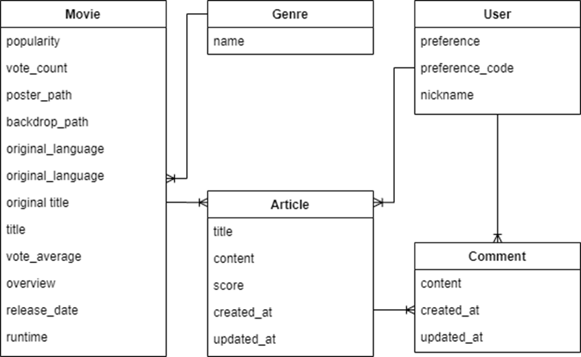

# <span style="color:#C82518">MoviePop</span>

## Table of Contents

[TOC]

---


## Project Description

#### 개요, 콘셉트

- 영화정보 데이터베이스를 기반으로 개인의 취향에 따른 장르, 영화 추천 웹 서비스
- 영화 추천 방식은 5가지 (개인별 추천, 최신 영화, 혼자 보기 좋은 영화, 커플 추천 영화, 가족 추천 영화)
- 영화 리뷰, 댓글을 작성, 수정, 삭제 할 수 있는 커뮤니티 기능 구현
- 개인정보와 장르변 선호도 수치(Corn Graph), 작성한 리뷰, 댓글, 좋아요 표시 글을 확인할 수 있는 Information 페이지 제공
- 개인정보 수정 기능 제공
- 영화 데이터베이스를 업데이트 할 수 있는 앱 구현
- DB에서 키워드를 바탕으로 영화를 찾을 수 있는 검색기능 구현
- 전반적인 디자인 콘셉트는 **팝콘을 들고 영화관에 입장하는 상황**을 바탕으로 구성


#### 프로젝트 구조

```
final-pjt/
    ├── accounts/templates/
    │   ├── detail.html
    │   ├── login.html
    │   ├── signup.html
    │   └── update.html
    │
    ├── community/templates/
    │   ├── create.html
    │   ├── detail.html
    │   ├── index.html
    │   └── update.html
    │
    └── final_pjt/
    │   ├── templates/base.html
    │   ├── settings.py
    │
    └── make_dataset/templates/
    │   ├── update_dataset.html
    │
    └── movies/templates/
        ├── index.html
        ├── movie_detail.html
        ├── recommendation.html
        └── search.html
```


####  ERD



- 5개 테이블로 구성
  - Genre <=> Movie : ManyToMany
  - 이외에는 ERD참고


#### 주요기능

1. **영화의 장르정보와 개인의 장르 선호도, 평점을 기반으로 필터링 알고리즘 구현**
   - 외부 알고리즘 사용 X
   - Contents Based(장르) - Colloabrative(리뷰 평점기반) 을 혼합한 Hybrid Filtering 알고리즘
   - 개인별 선호도 Code를 부여 => 그래프로 활용
2. **영화 리뷰와 댓글을 바탕으로 소통할 수 있는 커뮤니티 기능 구현**
   - 리뷰 작성시 영화정보를 제공함으로써 리뷰에 참고 가능
   - 리뷰에 부여한 평점은 앞으로 영화 추천 알고리즘에 반영
   - 리뷰에는 좋아요와 댓글을 통해 관심도를 표현 할 수 있으며 모두 ajax요청을 통해 사용자 경험 향상
   - 리뷰 게시글이 많을 때는 페이지네이션 기능으로 스크롤 반경을 감소
   - 영화 정보 디테일 페이지에서 영화와 관련된 리뷰를 모아서 확인 가능
3. **예매, 영상 자료를 얻을 수 있는 링크 기능**
   - 웹사이트를 탐색하여 관련 데이터를 얻을 수 있는 페이지를 자동으로 제공
4. **키워드 기반 검색 기능**
   - 키워드를 바탕으로 제목, 줄거리, 개봉일 정보와 일치하는 영화정보를 제공
   - 리뷰작성시 힘들게 영화를 찾을 필요없이 영화를 검색하면 자동으로 리뷰에 반영
5. **회원 가입시 장르 선호도 선택 기능**
   - 영화 추천 알고리즘 구현에 반영
   - 개인정보 페이지에서 CornGraph(팝콘지수) 형태로 사용자의 선호도 확인가능
   - 선호도는 언제든지 수정 가능
6. **관리자 기능**
   - 각종 데이터 관리 기능 제공


## 실행 방법

#### 개발환경

- **Python  v3.7.7**
- **Django  v3.1.3**
- **VSCode  v1.51**
- CSS, Vanilla JS


#### 웹사이트, 연락처

- https://final-pjt-movieapp.herokuapp.com/
- github: [Jo-Myounghee](https://github.com/Jo-Myounghee)
- github: [AntBean94](https://github.com/AntBean94)


## 기타

#### 알려진 버그

- 로그인, 로그아웃시 간헐적으로 Forbidden(403) 에러 발생
  - 초기화 하면 로그인, 로그아웃은 정상적으로 되지만, 원인은 찾지 못하였음


#### 라이선스

